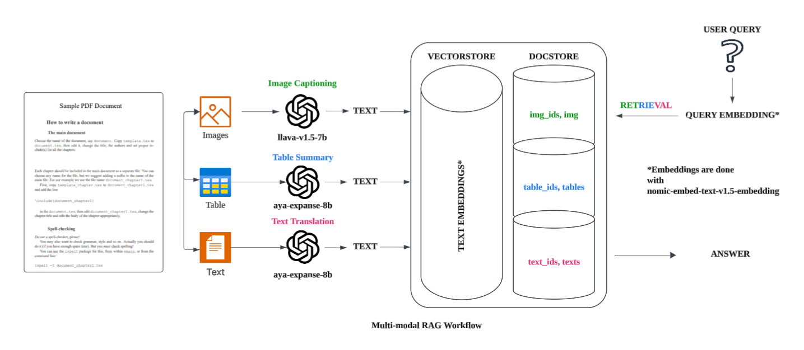

# OmniPDF

## Table of Contents

- [Introduction](#introduction)
- [Features](#features)
- [Installation](#installation)
- [Usage](#usage)
- [Contributing](#contributing)
- [License](#license)

## Introduction

OmniPDF is a PDF analyzer capable of translation, summarization, captioning and conversational capabilities through Retrieval-Augmented-Generation (RAG).

It aims to bridge language gaps and enhance document comprehension through the implementation of Artificial Intelligence and Machine Learning techniques.

## Features

- **Multi-Language Support**: Supports translation across 23 languages
- **PDF Analysis**: Offers citation supported analysis of content through conversational AI
- **Summarization**: Provides concise summaries of lengthy documents

## RAG Diagram



## Installation

This project is dependent on external softwares such as Tesseract, Poppler and LMStudio

### Tesseract Installation

<hr>
Download Link: https://github.com/UB-Mannheim/tesseract/wiki

<br>**IMPORTANT**

Ensure to select **_all additional language packs_** during Tesseract installation

After Installation, ensure that Tesseract is added into the environment path<br>

Default Tesseract path: C:\Program Files\Tesseract-OCR

A guide on adding Environmental Variables:
https://www.computerhope.com/issues/ch000549.htm

### Poppler Installation

<hr>
Download Link: https://github.com/oschwartz10612/poppler-windows/releases/tag/v24.08.0-0

<br>**IMPORTANT**

After Installation, ensure that Poppler is added into the environment path<br>

Popple path: your\poppler\path\poppler-24.08.0\Library\bin

A guide on adding Environmental Variables:
https://www.computerhope.com/issues/ch000549.htm

## LM Studio Installation

Download Link: https://lmstudio.ai/<br><br>
OmniPDF utilizes the following Large Language Models<br>

<ul>
<li>aya-expanse-8b is used for Translation and Summarization<br>
<li>Llava-v1.5-7b is used for Image Captioning  <br>
<li>nomic-embed-text-v1.5 is used for Text Embedding.
</ul>

These models can be found through LMStudio's Model discovery interface as such:
<br><br>
After downloading them, the models can be found in the Models Page<br><br>
<br>

**_Note on Optimization_**

In LMStudio's Developer tab, the following parameters can be adjusted

<ul>
<li> Context Length
<li> GPU offload layers
</ul>

## Usage

### Initial Setup

<b> Setting up the libraries</b><br><br>
Create and activate a new virtual environment and install the reuired packages

```
 $ python -m venv .venv
 $ .venv/Scripts/activate
 $ pip install -r requirements.txt
```

<b> Hosting LLMs on LMStudio</b><br>

In LMStudio's Developer tab, load the Models downloaded previously and set the server status to 'running'.

At this point the Models are hosted locally and can be reached at port 1234 (default)


**_Side note_**

LM Studio's APIs can be used through an OpenAI compatibility mode with the following supported Endpoints:

```
GET  /v1/models
POST /v1/chat/completions
POST /v1/embeddings
POST /v1/completions
```

## Contributing

Guidelines for contributing to your project.

## License

State the license under which your project is distributed.
